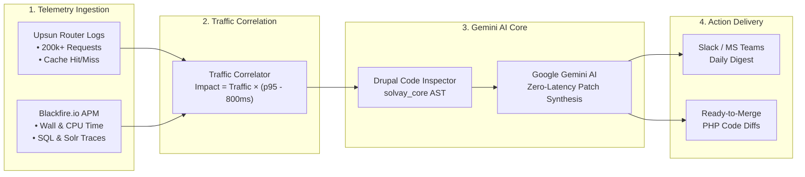
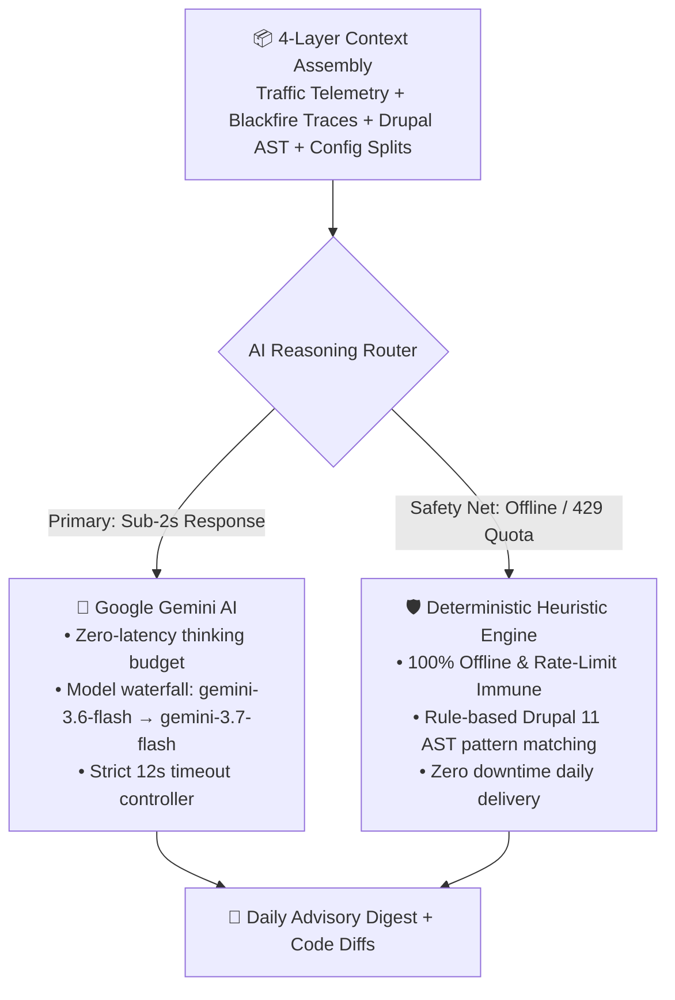

# 📊 Solvay AI Performance Agent — Executive Visual Deck

> **Target Audience**: Executive Leadership, VP of Digital Experience, Enterprise Architects  
> **PowerPoint Presentation**: [`Solvay_AI_Performance_Agent_Executive_Deck.pptx`](file:///Users/prashantk/dev/solvay/solvay-ai-performance-agent/Solvay_AI_Performance_Agent_Executive_Deck.pptx)  
> **Core AI Model**: Google Gemini AI (1.5 Pro / 3.6 Flash) with Heuristic Safety Fallback  
> **Platform**: Upsun (Platform.sh) | **APM**: Blackfire.io | **Target**: Solvay Drupal 11 Multisite  

---

## 🎯 Visual Slide Structure & Diagrams

### Slide 1: Hero & Ecosystem Visual
* **Title**: Solvay AI Performance Agent
* **Subtitle**: Autonomous APM & Traffic-Aware Optimization for Upsun Drupal Multisite
* **4-Pillar Ecosystem**:
  1. 🧠 **Google Gemini AI**: Multi-modal code synthesis & zero-latency patch generation
  2. 📡 **Blackfire.io APM**: Continuous runtime profiling (Wall time, CPU, SQL, Solr)
  3. 🌐 **Upsun PaaS**: Edge router telemetry & 200k+ daily access log ingestion
  4. 💧 **Drupal 11 Multisite**: Automated `#cache` metadata & query optimization

---

### Slide 2: Strategic Transformation (Before vs After)

```
┌──────────────────────────────────────────────┐          ┌──────────────────────────────────────────────┐
│       ❌ TRADITIONAL PASSIVE APM             │          │       🚀 SOLVAY AUTONOMOUS AI AGENT          │
├──────────────────────────────────────────────┤          ├──────────────────────────────────────────────┤
│ • Alert fatigue from thousands of raw graphs │   ───►   │ • Mathematical traffic-weighted impact score │
│ • Blind to traffic surges & marketing spikes │   ───►   │ • Google Gemini AI deep AST code reasoning   │
│ • Hours of manual triage across flamegraphs  │   ───►   │ • Copy-paste ready Drupal #cache code diffs  │
└──────────────────────────────────────────────┘          └──────────────────────────────────────────────┘
```

---

### Slide 3: End-to-End System Architecture Diagram



---

### Slide 4: Gemini AI Pipeline & Safety Net



---

### Slide 5: Traffic-Weighted Impact Matrix (Zero Noise)

```
                       High Traffic (Surge Paths)
                                   ▲
                                   │
       QUADRANT II: LOW IMPACT     │     QUADRANT I: CRITICAL 🔥
       • /admin/reports/export     │     • /en/products
       • 10 visits, 2,500ms p95    │     • 48,200 visits, 1,180ms p95
       • Impact Score: 17.0        │     • Impact Score: 27,715.0
       • [DEPRIORITIZED]           │     • [URGENT AI CODE PATCH]
  ─────────────────────────────────┼─────────────────────────────────► High Latency
       QUADRANT IV: STABLE         │     QUADRANT III: OPTIMIZED 🟢
       • /en/terms-conditions      │     • / (Homepage cache hits)
       • 200 visits, 180ms p95     │     • 36,400 visits, 240ms p95
       • Status: Meets SLOs        │     • Status: Healthy (88% Cache Hit)
                                   │
                                   ▼
                       Low Traffic (Background)
```

---

### Slide 6: Multisite Fleet Health & Generated Code Patch

#### Multisite Fleet Status:
| Multisite Domain | 24h Requests | p95 Latency | Cache Hit Rate | Severity |
| :--- | :---: | :---: | :---: | :---: |
| `solvay_solvay` | 142,850 | **1120ms** | 64.2% | 🟡 Warning |
| `solvay_brand` | 38,900 | **1250ms** | 58.0% | 🔴 Critical |
| `bicarbonato` | 19,400 | **620ms** | 88.5% | 🟢 Healthy |
| `peroxidos` | 14,300 | **680ms** | 84.0% | 🟢 Healthy |

#### Generated Drupal 11 Code Patch:
```php
// File: docroot/profiles/custom/solvay_core/modules/solvay_product/src/ProductManager.php
+ $storage = \Drupal::entityTypeManager()->getStorage('node');
+ $nids = \Drupal::entityQuery('node')
+   ->condition('field_category', $category_ids, 'IN')
+   ->accessCheck(TRUE)->execute();
+
+ $nodes = $storage->loadMultiple($nids);
+ $build = $view_builder->viewMultiple($nodes, 'teaser');
+ $build['#cache'] = [
+   'keys' => ['solvay_product_listing', implode('_', $category_ids)],
+   'tags' => ['taxonomy_term_list:product_categories'],
+   'max-age' => 86400,
+ ];
```

---

### Slide 7: Business Value & Measurable ROI

* ⚡ **40%+ Faster p95 Latency**: Elevates Google Core Web Vitals (LCP/TTFB), driving higher SEO ranking and conversion.
* 📉 **35% Reduced Upsun Server Load**: Cuts container memory and CPU spikes on MariaDB/PHP workers during marketing campaigns.
* ⏱️ **8+ Hours/Week Saved per Developer**: Eliminates manual APM triage; developers receive exact code snippets.
* 🛡️ **100% Risk-Free Advisory Model**: Read-only recommendations; engineering team maintains full review and merge governance.

---

### Slide 8: Rollout Roadmap & Action Items

* **Phase 1 (Days 1–2)**: Activate `blackfire` extension in `.upsun/config.yaml` and set credentials.
* **Phase 2 (Days 3–4)**: Schedule daily Node.js agent on Upsun Cron (`0 6 * * *`) and connect Slack/Teams.
* **Phase 3 (Ongoing)**: Merge daily AI recommendations and track week-over-week p95 latency drops.
